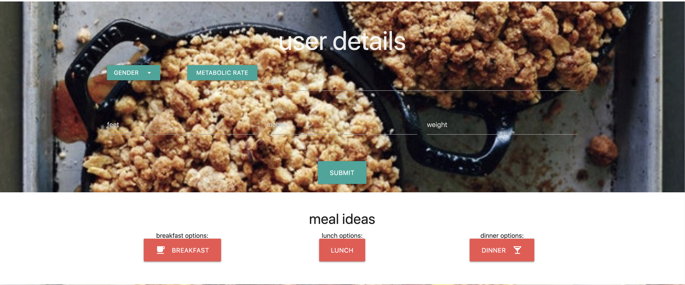

# foodiesUnite

Why foodiesUnite? Currently everyone is trying to find a way to cut costs, and save money to continue living during these uncertain times. What better place to start than your own kitchen? We wanted to create an app that helped us acheive a certain goal, whether you're just looking to maintain, or lose some pounds, or even if you're trying to get jacked like Mr. Bean, we have something you'll like. By inputing your information (Age,Sex,Height, Weight) We'll be able to give you different sets of meal options based on your desired goal. Gone are the days of wondering whether butter is a carb, and we'll always be here to reassure you that there has never been a sadness that can't be cured by breakfast food.

# Purpose
Build our first app using an API. Retrieve data from a third-party meal plan API (Edamam Nutrition Analysis) and using it in context.

# Functionality
Build a dashboard application with input functionality to find meal plans for multiple body type goals.

# Deployed site: 
https://94cooper94.github.io/foodiesUnite/

## App Demo
### User Input - click search 

### Technologies Used 
- JavaScript
- Edamam API
- HTML
- CSS

### Contributors
- Cooper Ahearn
- Desmond Aldridge
- Austin Thorpe
- Justin Pricer
