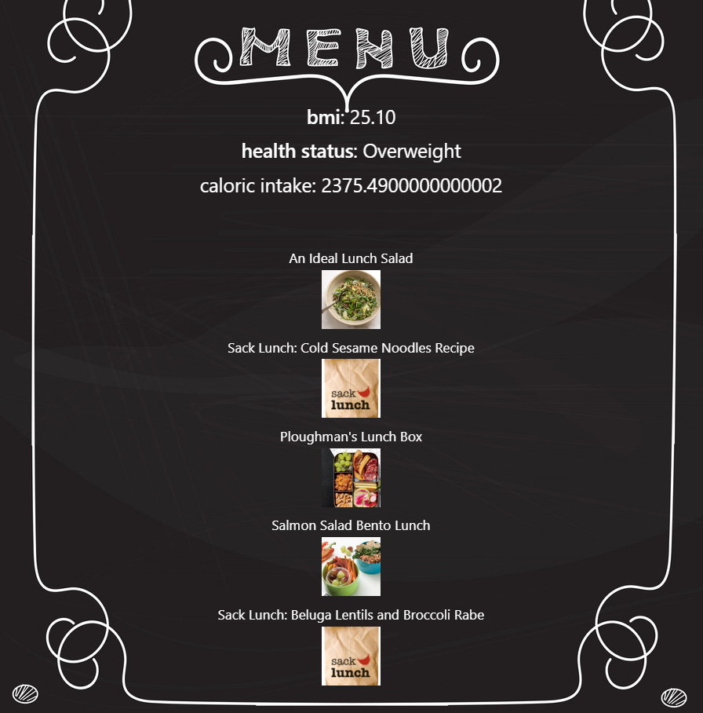

# foodiesUnite

Why foodiesUnite? Currently everyone is trying to find a way to cut costs, and save money to continue living during these uncertain times. What better place to start than your own kitchen? We wanted to create an app that helped us achieve a certain goal, whether you're just looking to maintain, lose some pounds, or even if you're trying to get jacked like Mr. Bean, we have something you'll like. By inputing your information (Age,Sex,Height, Weight) We'll be able to give you different sets of meal options based on your desired goal. Gone are the days of wondering whether butter is a carb, and we'll always be here to reassure you that there has never been a sadness that can't be cured by breakfast food.

# Purpose
Build our first app using an API(s). We've intergrated Materialize, EdamamAPI, and RapidAPI Fiteness calculator. together they pull the users input in order to plug their information into the fitness calculator, and in turn gernerate user-specific data that will generate meals using the Edamam API. 

# Functionality
Build a dashboard application with input functionality to explore a variety of meal options that take caloric intake into account.

# Deployed site: 
View a live demo of our website here: https://94cooper94.github.io/foodiesUnite/

## App Demo

### Technologies Used 
- GitHub & GitHub Pages
- HTML & CSS
- Materialize CSS & JavaScript Bootstrap
- JavaScript & JQuery
- EdamamAPI
- RapidAPI Fitness Calculator

### Contributors
- Cooper Ahearn - github, layout & style mastermind
- Desmond Aldridge - javascript virtuoso
- Austin Thorpe - innovator & backend engineer
- Justin Pricer - branding & public relations